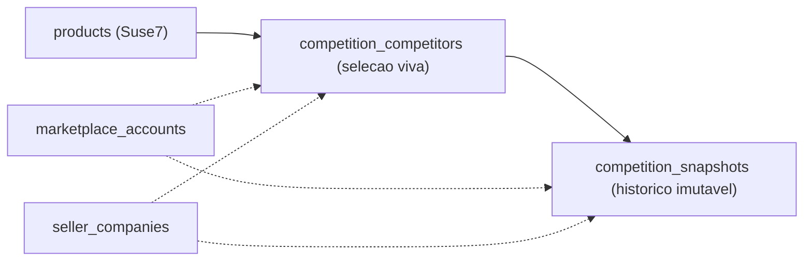

# S1 — Modelagem do Banco de Concorrência

**Tipo:** documentação técnica da modelagem de banco
**Escopo:** explicar as tabelas `competition_competitors` e `competition_snapshots`, índices, limite de 9 ativos, RLS e como isso prepara o backend
**Fora de escopo:** handlers, endpoints, frontend, Precificação Inteligente, chamadas ao Mercado Livre

> Migration: [`supabase/migrations/20260608154500_create_competition_tables.sql`](../../supabase/migrations/20260608154500_create_competition_tables.sql)
> Base conceitual: [`mercado-livre-discovery.md`](./mercado-livre-discovery.md) (§5 dados mínimos, §7 modelagem)

---

## 1. Visão geral

A concorrência separa **duas responsabilidades**:

| Tabela | Papel | Natureza |
|---|---|---|
| `competition_competitors` | Concorrentes que o seller escolheu monitorar, por produto/SKU | **Seleção viva** (muda no tempo; sincroniza com o marketplace) |
| `competition_snapshots` | Capturas temporais (preço, frete, reputação, oferta) | **Histórico imutável** (append-only; memória própria do Suse7) |

## 2. Por que separar seleção viva e histórico

- O seller **escolhe** quais concorrentes acompanhar (até 9 por produto) — isso é estado mutável.
- Os concorrentes ativos **mudam com o tempo** (entram e saem da disputa).
- O **marketplace é a fonte de sincronização atual**, mas **não fornece histórico** nem dados privados.
- O **Suse7 é a fonte de memória histórica**: cada captura vira um snapshot imutável, permitindo comparar preço/frete/reputação ao longo do tempo.
- Misturar as duas coisas quebraria o histórico ao desativar/atualizar um concorrente.

## 3. `competition_competitors` (seleção viva)

- Entidade principal: **produto/SKU** (`product_id` → `products.id`, `ON DELETE CASCADE`).
- Isolamento multi-tenant/multi-CNPJ/multi-conta: `user_id`, `marketplace`, `marketplace_account_id` (→ `marketplace_accounts`, `SET NULL`), `seller_company_id` (→ `seller_companies`, `SET NULL`).
- `competitor_listing_id` é o anúncio concorrente (MLB id). Campos de exibição: `competitor_title`, `competitor_seller_id`, `competitor_store_name`, `competitor_permalink`, `competitor_thumbnail`.
- `source_strategy`: `ml_catalog` | `ml_search` (qual estratégia descobriu).
- `is_active`: remoção pelo seller é **soft-delete** (`is_active = false`) — preserva os snapshots.
- `last_seen_price numeric(14,2)` + `last_seen_currency` + `last_captured_at`: último valor observado (atalho de leitura; o histórico fica nos snapshots).
- `created_at` / `updated_at` (trigger `s7_touch_updated_at`).

## 4. `competition_snapshots` (histórico imutável)

- **Append-only**: sem `updated_at`, sem trigger de update, sem unique por preço/data — múltiplos snapshots do mesmo concorrente ao longo do tempo são esperados.
- `competitor_id` → `competition_competitors.id` (`ON DELETE CASCADE`); `product_id` → `products.id` (`CASCADE`); conta/empresa em `SET NULL` (histórico sobrevive a mudança de conta/empresa).
- Dados da captura: `competitor_price numeric(14,2)`, `currency`, `shipping jsonb`, `listing_type`, `reputation jsonb`, `sales_hint integer`, `raw_snapshot jsonb`, `captured_at`.
- `sales_hint` é **estimado** (sold_quantity do ML) — nunca tratado como número financeiro.

## 5. Limite de 9 concorrentes ativos por produto

- Trigger `s7_competition_enforce_active_limit` (`BEFORE INSERT OR UPDATE`).
- Conta apenas `is_active = true` por `(user_id, marketplace, product_id)`, ignorando o próprio registro (`id <> NEW.id`).
- Bloqueia o 10º ativo com mensagem clara: **`Limite de 9 concorrentes ativos por produto atingido.`** (SQLSTATE `check_violation`).
- Permite atualizar um ativo existente e permite desativar (`is_active = false`) sem bloquear.
- Reforço adicional de integridade: índice **unique parcial** `competition_competitors_active_uidx` em `(user_id, marketplace, product_id, competitor_listing_id) WHERE is_active = true` evita duplicar o mesmo concorrente ativo.

## 6. Índices

**`competition_competitors`:** unique parcial de ativos; `(user_id, product_id) WHERE is_active`; `(marketplace_account_id)`; `(seller_company_id)`; `(competitor_listing_id)`; `(marketplace, product_id)`.

**`competition_snapshots`:** `(competitor_id, captured_at DESC)`; `(product_id, captured_at DESC)`; `(user_id, captured_at DESC)`; `(marketplace_account_id, captured_at DESC)`; `(seller_company_id, captured_at DESC)`.

## 7. RLS e segurança

- RLS habilitada nas duas tabelas; isolamento por `auth.uid() = user_id`.
- `competition_competitors`: SELECT/INSERT/UPDATE/DELETE do próprio usuário.
- `competition_snapshots`: apenas SELECT e INSERT do próprio usuário — **sem UPDATE/DELETE** (imutabilidade reforçada também pela RLS).
- Handlers de escrita usam **service role** (bypassa RLS) com filtro explícito por `user_id`, padrão já adotado nas demais tabelas do projeto.

## 8. Como isso prepara a próxima fase (Backend de Concorrência)

Com o banco modelado, o handler `/api/competition/*` poderá:

- **descobrir** concorrentes (Strategy Pattern ML: catálogo/busca) e **persistir a seleção** em `competition_competitors` (respeitando o limite de 9 via banco);
- **capturar snapshots** periódicos/on-demand em `competition_snapshots` para histórico;
- **agregar** preço/posição por produto para alimentar a aba Concorrentes da Precificação Inteligente.

> Observação: o ambiente atual não possui `psql`/Supabase CLI configurados para aplicar/validar a migration localmente; a sintaxe foi revisada manualmente. A aplicação ocorrerá no fluxo padrão de migrations do projeto (Supabase) com credenciais apropriadas.
