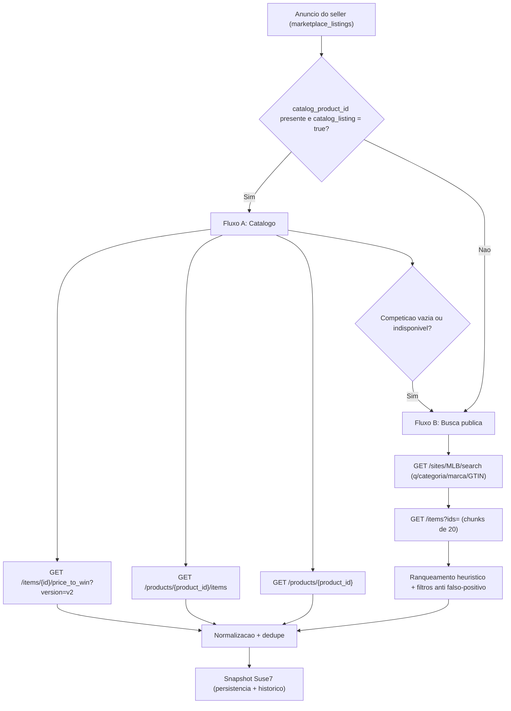
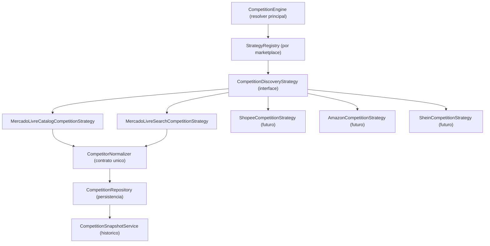

# S1 — Descoberta Arquitetural: Concorrência no Mercado Livre

**Tipo:** investigação técnica, descoberta de APIs e desenho arquitetural
**Escopo:** mapeamento das APIs oficiais do Mercado Livre para concorrência; estratégias de descoberta (catálogo x busca pública); Strategy Pattern multi-marketplace; dados mínimos de snapshot; riscos; plano da próxima fase (modelagem de banco)
**Fora de escopo:** implementação de backend produtivo, migrations, tabelas, endpoints, alterações de frontend e na Precificação Inteligente

> Documento de fase **S1 — Concorrência Inteligente Multi-Marketplace**. Nenhuma funcionalidade final é implementada aqui. Toda especificação de API do Mercado Livre deve ser **revalidada contra a documentação oficial no momento da implementação**, pois a ML altera contratos e políticas de acesso com frequência.

---

## 1. Resumo executivo

O Suse7 vai monitorar concorrentes **por produto/SKU**, com até 9 concorrentes por produto, alimentando depois a aba **Concorrentes** da Precificação Inteligente. A descoberta de concorrentes no Mercado Livre tem **dois caminhos oficiais distintos**, escolhidos conforme o anúncio do seller seja ou não de catálogo:

- **Fluxo A — Catálogo** (quando o anúncio tem `catalog_product_id`): usa a competição oficial da PDP do catálogo (`price_to_win`, `/products/{id}/items`, `/products/{id}`). É a fonte **mais precisa e oficial** de concorrência, pois a própria ML define quem disputa o mesmo produto.
- **Fluxo B — Busca pública** (quando o anúncio **não** é de catálogo): usa `GET /sites/MLB/search` por título/categoria/marca/GTIN + `GET /items?ids=` para detalhar, com **normalização e ranqueamento** próprios. É uma **aproximação heurística** (sujeita a falsos positivos).

Estado atual do código (ver §8): a integração ML já existe e é robusta (`mercadoLibreItemsApi.js`, OAuth por conta em `mlToken.js`), mas **nenhum dos endpoints de concorrência** (`price_to_win`, `/products/...`, `/sites/MLB/search`) é usado ainda. O backend de concorrência (`/api/competition/*`) está **roteado, porém não implementado**. Portanto, esta trilha é majoritariamente *greenfield*, mas construída sobre padrões já consolidados.

**Recomendação de motor:** estratégia híbrida com **prioridade ao catálogo** e **fallback automático para busca pública** quando não houver `catalog_product_id` (ou quando o catálogo retornar competição vazia/indisponível), sempre persistindo **snapshots próprios Suse7** para histórico (a ML não garante histórico nem dados privados do concorrente).

---

## 2. Endpoints oficiais do Mercado Livre para concorrência

> Base da API: `https://api.mercadolibre.com`. Padrão de chamada do projeto: `fetch` cru com `Authorization: Bearer <access_token>` e `Accept: application/json` (ver `src/handlers/ml/_helpers/mercadoLibreItemsApi.js`).

### 2.1 Endpoints de catálogo (Fluxo A)

| Endpoint | Método | Uso na concorrência | OAuth | Observações |
|---|---|---|---|---|
| `/items/{ITEM_ID}/price_to_win?version=v2` | GET | Status da competição de catálogo do **anúncio do seller**: quem ganha a buy box, preço para vencer, share de visitas | **Sim** (token do seller dono do item) | Só faz sentido para itens com `catalog_listing = true` / `catalog_product_id` |
| `/products/{PRODUCT_ID}/items` | GET | Lista as **publicações concorrentes** que disputam a mesma PDP de catálogo | **Sim** (recomendado) | Paginação; é a lista de ofertas da PDP |
| `/products/{PRODUCT_ID}` | GET | Metadados do produto de catálogo (nome, atributos, fotos, `buy_box_winner`, `children_ids`) | **Sim** (recomendado) | Útil para contexto/raio-x do produto de catálogo |

**Campos esperados de `price_to_win` (a confirmar na implementação):**

- `status` — situação competitiva (ex.: `competing`, `winning`, `listed`, `sharing_first_place`, `not_listed`, `not_competing`)
- `price_to_win` — preço necessário para assumir/segurar o primeiro lugar (pode vir `null`)
- `winner` — objeto do vencedor atual: `item_id`, `price`, `currency_id`, `sold_quantity`, `shipping`, `seller_id` (quando exposto)
- `boosts` — alavancas consideradas (ex.: frete, reputação, tipo de anúncio)
- `visit_share` — participação de visitas do item do seller
- `competitors_sharing_first_place` — quantos dividem o 1º lugar
- `reason` — motivo da posição (ex.: `price`, `shipping`, `listing_type`)
- estrutura de **boosts/competição** com referências aos itens competidores na PDP

**Campos esperados de `/products/{id}/items`:**

- `results[]` — itens competindo na PDP, tipicamente com `item_id`, `seller_id`, `price`, `original_price`, `shipping` (incl. `free_shipping`), `condition`, `listing_type_id`, `sold_quantity` (quando disponível), `winner`/posição
- `paging` — `total`, `offset`, `limit`
- filtros usuais: paginação (`limit`/`offset`); pode aceitar atributos do produto para refinar variações

### 2.2 Endpoints fora de catálogo (Fluxo B)

| Endpoint | Método | Uso na concorrência | OAuth | Observações |
|---|---|---|---|---|
| `/sites/MLB/search` | GET | Busca pública por título/categoria/marca/GTIN para **descobrir candidatos** | **Sim** (a ML restringiu busca anônima; hoje exige token) | Site fixo `MLB` (Brasil) nesta fase |
| `/items?ids=ID1,ID2,...` | GET | **Multiget** para detalhar os candidatos retornados pela busca | **Sim** | Já implementado no projeto (`fetchItemsByIds`) |

**Filtros relevantes de `/sites/MLB/search` (a confirmar):**

- `q` — termo livre (título)
- `category` — id de categoria (ex.: `MLBxxxx`)
- `nickname` / `seller_id` / `official_store_id` — recorte por vendedor/loja oficial
- `price=min-max` — faixa de preço
- `condition` — `new` / `used`
- `attributes` / `BRAND`, `GTIN` — refino por marca/GTIN quando disponível via parâmetros de atributo
- ordenação: `sort` (ex.: `price_asc`, `price_desc`, `relevance`)

**Limites de paginação (a confirmar na doc oficial no momento da implementação):**

- `limit` por página: tipicamente **máx. 50**
- `offset` máximo: tipicamente **1000** (teto efetivo de ~1000 resultados navegáveis)
- portanto, **não dá para varrer categorias inteiras**; a busca precisa de termos específicos + filtros para ser útil

**Limites de multiget (`/items?ids=`):**

- **máx. 20 ids por chamada** — o projeto já respeita isso: `ITEMS_MULTIGET_CHUNK = 20` em `mercadoLibreItemsApi.js` (`fetchItemsByIds`); resposta vem em envelope `[{ code, body }]`

### 2.3 Dados públicos x privados (o que dá e o que não dá)

| Dado do concorrente | Disponível? | Fonte |
|---|---|---|
| Preço atual, `original_price` | Sim | search / items / price_to_win |
| Título, thumbnail, permalink | Sim | search / items |
| Frete grátis / modo de frete | Sim (parcial) | `shipping` do item |
| Tipo de anúncio (`listing_type_id`) | Sim | item |
| `seller_id` | Sim | item / search |
| Nickname / nome da loja do concorrente | Parcial | `/users/{seller_id}` (público limitado) ou campo `seller.nickname` na busca |
| Reputação do vendedor | Parcial | `/users/{seller_id}` → `seller_reputation` (nível/qualificação públicos) |
| **Vendas reais do concorrente** | **Não confiável** | `sold_quantity` é **agregado/estimado** e pode estar ausente, defasado ou arredondado |
| Custos, margem, impostos do concorrente | **Não** | dado privado — nunca exposto |
| Histórico de preço do concorrente | **Não** | a ML não fornece — **Suse7 precisa criar snapshots próprios** |

---

## 3. Estratégia por tipo de anúncio

A decisão nasce do anúncio do seller já persistido em `marketplace_listings` (campos `catalog_listing` e `catalog_product_id`, mapeados em `mlListingsPersist.js`).



### 3.1 Fluxo A — Anúncios de catálogo

**Quando:** `catalog_listing = true` e `catalog_product_id != null`.

**Passos:**

1. `GET /items/{ITEM_ID}/price_to_win?version=v2` para o item do seller → status competitivo, `price_to_win`, `winner`, `visit_share`, `competitors_sharing_first_place`, `reason`, `boosts`.
2. `GET /products/{catalog_product_id}/items` → lista das publicações concorrentes na PDP (preço, frete, seller, tipo de anúncio, posição).
3. `GET /products/{catalog_product_id}` (opcional) → contexto do produto (nome, atributos, `buy_box_winner`).
4. **Normalização** dos concorrentes (excluir o próprio seller, deduplicar por `item_id`/`seller_id`, padronizar campos).

**Vantagens:** fonte oficial, sem ambiguidade — a ML já agrupou quem compete. **Cobre buy box e price_to_win** diretamente.

### 3.2 Fluxo B — Anúncios fora de catálogo

**Quando:** sem `catalog_product_id` (ou fallback do Fluxo A).

**Passos:**

1. Montar a query a partir dos dados do anúncio do seller: `title` (núcleo), `category_id`, `BRAND`, `GTIN/EAN` (de `marketplace_listing_attributes`), atributos relevantes.
2. `GET /sites/MLB/search` com `q` + filtros (categoria, faixa de preço, marca quando houver) → coletar `item_id`s candidatos (respeitando teto de offset).
3. `GET /items?ids=` em chunks de 20 para detalhar candidatos.
4. **Ranqueamento heurístico** por similaridade (match de GTIN > marca+modelo > categoria+título), filtros anti falso-positivo (ex.: excluir kits/acessórios quando o produto é o item principal, faixa de preço plausível), e corte por relevância.
5. **Normalização** idêntica ao Fluxo A (mesmo contrato de saída).

**Cuidados:** busca por título traz **falsos positivos**; o ranqueamento e os filtros são parte essencial e devem ser versionados (ver `source_strategy` no snapshot).

---

## 4. Arquitetura — Strategy Pattern multi-marketplace

A descoberta deve nascer **desacoplada do Mercado Livre**, para escalar a Shopee/Amazon/Shein sem reescrever o motor.



### 4.1 Contrato da estratégia (proposta)

```text
interface CompetitionDiscoveryStrategy {
  // identifica o marketplace ("mercado_livre", "shopee", ...)
  marketplace(): string

  // diz se esta estrategia se aplica ao anuncio (ex.: catalogo x nao-catalogo)
  supports(context: DiscoveryContext): boolean

  // executa a descoberta e devolve concorrentes ja normalizados
  discover(context: DiscoveryContext): Promise<NormalizedCompetitor[]>
}

type DiscoveryContext = {
  userId: string
  marketplaceAccountId: string
  sellerCompanyId: string | null
  productIdInterno: string        // products.id (Suse7)
  sku: string | null
  listing: {
    externalListingId: string     // MLB id
    catalogProductId: string | null
    catalogListing: boolean
    categoryId: string | null
    title: string
    attributes: Record<string, string>  // BRAND, GTIN, etc.
  }
  accessTokenResolver: () => Promise<string>  // ver getValidMLToken
}
```

### 4.2 Resolver principal (CompetitionEngine)

- Recebe o `listing` do seller, escolhe a(s) estratégia(s) via `StrategyRegistry`.
- **Mercado Livre:** tenta `MercadoLivreCatalogCompetitionStrategy` (se `supports` = catálogo); se vazio/indisponível, cai para `MercadoLivreSearchCompetitionStrategy`.
- Aplica **rate limit / cache** (ver §6) antes de chamar a ML.
- Entrega ao `CompetitorNormalizer` → `CompetitionRepository` → `CompetitionSnapshotService`.

### 4.3 Aderência aos padrões já existentes

- **Token:** reutilizar `getValidMLToken(userId, { marketplaceAccountId })` de `src/handlers/ml/_helpers/mlToken.js` (refresh automático via `POST /oauth/token`, leitura de `ml_tokens`).
- **HTTP ML:** estender `src/handlers/ml/_helpers/mercadoLibreItemsApi.js` com `fetchItemPriceToWin`, `fetchCatalogProductItems`, `fetchCatalogProduct`, `searchSiteListings` — mesmo formato de `fetch` + tratamento de erro com `err.status`/`err.body`.
- **Roteamento:** o router já aponta `/api/competition/*` para `../src/handlers/competition/index.js` (hoje inexistente); a Fase de backend cria esse handler.

---

## 5. Dados mínimos para snapshot de concorrente (proposta, sem migration)

Estrutura mínima a persistir por concorrente capturado (alinhada aos campos que o frontend de concorrência já consome e ao padrão `marketplace_listings`):

| Campo | Tipo | Origem | Observação |
|---|---|---|---|
| `marketplace` | text | contexto | `mercado_livre` (multi-MKP futuro) |
| `product_id` | uuid | Suse7 | FK → `products.id` (entidade principal: produto/SKU) |
| `sku` | text | Suse7 | SKU do produto |
| `seller_company_id` | uuid | conta | FK → `seller_companies.id` (multi-CNPJ) |
| `marketplace_account_id` | uuid | conta | FK → `marketplace_accounts.id` |
| `competitor_listing_id` | text | ML | id do anúncio concorrente (MLB) |
| `competitor_title` | text | ML | título do anúncio concorrente |
| `competitor_price` | numeric | ML | preço atual |
| `currency` | text | ML | `BRL` |
| `competitor_seller_id` | text | ML | id do vendedor concorrente |
| `competitor_store_name` | text | ML | nickname/loja (parcial, público) |
| `competitor_permalink` | text | ML | link do anúncio |
| `competitor_thumbnail` | text | ML | imagem |
| `shipping` | jsonb | ML | `{ free_shipping, mode, logistic_type }` |
| `listing_type` | text | ML | `listing_type_id` |
| `reputation` | jsonb | ML | nível/qualificação públicos (quando houver) |
| `sales_hint` | integer | ML | `sold_quantity` **estimado** (pode ser null) |
| `source_strategy` | text | motor | `ml_catalog` \| `ml_search` (+ versão do heurístico) |
| `raw_snapshot` | jsonb | ML | payload bruto para auditoria/retrocompatibilidade |
| `captured_at` | timestamptz | motor | momento da captura (base do histórico) |

> Distinguir **seleção** (concorrentes que o seller escolheu monitorar, até 9 por produto) de **snapshot** (captura temporal). A seleção é a entidade "viva"; o snapshot é o histórico imutável.

---

## 6. Riscos e limitações

1. **Dados privados inacessíveis:** custo, margem, impostos e estoque do concorrente **nunca** são expostos. O Suse7 trabalha só com dados públicos + inteligência própria.
2. **Vendas reais indisponíveis/estimadas:** `sold_quantity` é agregado, pode estar ausente, defasado ou arredondado. **Não** usar como número financeiro; tratar como *hint*.
3. **Falsos positivos na busca pública:** `q` por título traz itens não equivalentes (kits, acessórios, variações). Mitigação: priorizar GTIN/marca, filtros de categoria/faixa de preço, ranqueamento versionado.
4. **Catálogo depende de `catalog_product_id`:** itens fora de catálogo não têm `price_to_win`; a qualidade cai para a heurística da busca.
5. **Política de acesso da busca:** a ML restringiu busca anônima — `/sites/MLB/search` hoje exige token; mudanças de política podem afetar o fluxo.
6. **Rate limit / cota:** chamadas em volume (multiget + search + price_to_win por produto) consomem cota. Necessário **cache de curto prazo** + **agendamento/janelas** + backoff em `429`/`5xx`.
7. **Histórico é responsabilidade do Suse7:** sem snapshots próprios não há comparação temporal. Snapshots são o coração do monitoramento (§S1 — Snapshot e Histórico).
8. **Multi-CNPJ / multi-conta:** a resolução de token e o isolamento precisam respeitar `marketplace_account_id` + `seller_company_id` + `user_id` (RLS).
9. **Sazonalidade de contrato ML:** versões (`?version=v2`), nomes de campos e limites de paginação mudam — revalidar na implementação.

---

## 7. Recomendação para a próxima fase — S1: Modelagem do Banco de Concorrência

> Proposta (não executar agora). Seguir convenções de `suse7-backend/supabase/migrations/` (`YYYYMMDDHHMMSS_descricao.sql`, `gen_random_uuid()`, `timestamptz default now()`, RLS `auth.uid() = user_id`, trigger `s7_touch_updated_at`, índices parciais, unique parcial com `COALESCE`).

### 7.1 Tabela de seleção — `competition_competitors` (concorrentes monitorados, "vivos")

Campos-chave: `id`, `user_id`, `marketplace`, `marketplace_account_id`, `seller_company_id`, `product_id` (FK `products`), `sku`, `competitor_listing_id`, `competitor_title`, `competitor_seller_id`, `competitor_store_name`, `competitor_permalink`, `competitor_thumbnail`, `source_strategy`, `is_active`, `last_seen_price`, `last_captured_at`, `created_at`, `updated_at`.

- **Limite por produto (até 9):** validar na aplicação **e** reforçar no banco (ex.: trigger de contagem por `product_id` com `is_active = true`, ou checagem no upsert do handler).
- **Unique parcial** (evita duplicar o mesmo concorrente ativo por produto):
  ```sql
  CREATE UNIQUE INDEX IF NOT EXISTS competition_competitors_active_uidx
    ON public.competition_competitors (
      user_id, marketplace, product_id, competitor_listing_id
    )
    WHERE is_active = true;
  ```
- **Índices:** `(user_id, product_id) WHERE is_active`, `(marketplace_account_id)`, `(competitor_listing_id)`.

### 7.2 Tabela de histórico — `competition_snapshots` (imutável, temporal)

Campos do §5 (`competitor_price`, `currency`, `shipping jsonb`, `listing_type`, `reputation jsonb`, `sales_hint`, `raw_snapshot jsonb`, `source_strategy`, `captured_at`) + `competitor_id` (FK → `competition_competitors`) + `product_id` + isolamento (`user_id`, `marketplace_account_id`, `seller_company_id`).

- **Sem `updated_at`** (snapshot é imutável). **Não** unique por preço; é série temporal.
- **Índices:** `(competitor_id, captured_at DESC)`, `(product_id, captured_at DESC)`, `(user_id, captured_at DESC)`.
- Considerar **retenção/particionamento por data** se o volume crescer (multi-marketplace).

### 7.3 RLS (todas as tabelas)

```sql
ALTER TABLE public.competition_competitors ENABLE ROW LEVEL SECURITY;
CREATE POLICY competition_competitors_select_own ON public.competition_competitors
  FOR SELECT TO authenticated USING (auth.uid() = user_id);
-- + INSERT/UPDATE/DELETE com WITH CHECK (auth.uid() = user_id)
```
(Mesmo padrão para `competition_snapshots`.) Handlers de escrita usam service role + filtro `user_id`, como já ocorre em `marketplace_listings`.

### 7.4 Sequência sugerida das fases seguintes

1. **Modelagem do Banco** (migrations das duas tabelas acima + RLS + índices).
2. **Backend de Concorrência** (`src/handlers/competition/index.js` + `CompetitionEngine` + estratégias ML + normalizer + repository + snapshot service; estender `mercadoLibreItemsApi.js`).
3. **Cadastro de Concorrentes** (discover/select/remove com persistência imediata; limite de 9).
4. **Snapshot e Histórico** (captura agendada + on-demand).
5. **Integração com Precificação Inteligente** (provider + agregadores → aba Concorrentes).

---

## 8. Anexo — Estado atual do código (fonte da verdade)

| Item | Situação | Caminho |
|---|---|---|
| Client HTTP ML (items/pricing) | Existe e robusto | `src/handlers/ml/_helpers/mercadoLibreItemsApi.js` (base `https://api.mercadolibre.com`) |
| Multiget `/items?ids=` | **Implementado** (chunk 20) | `fetchItemsByIds` em `mercadoLibreItemsApi.js` |
| `price_to_win`, `/products/{id}/items`, `/products/{id}`, `/sites/MLB/search` | **Não usados** (net-new) | — |
| OAuth por conta + refresh | Existe | `src/handlers/ml/_helpers/mlToken.js` → `getValidMLToken`, tabela `ml_tokens` |
| Contas marketplace / multi-CNPJ | Existe | tabela `marketplace_accounts` (`user_id`, `marketplace`, `seller_company_id`, `external_seller_id`...) |
| Anúncio com catálogo | Persistido | `marketplace_listings`: `catalog_listing`, `catalog_product_id`, `category_id`, `domain_id` (map em `mlListingsPersist.js`) |
| GTIN/EAN/marca do anúncio | Relacional | `marketplace_listing_attributes` (não há coluna dedicada em `marketplace_listings`) |
| Rota `/api/competition/*` | **Roteada, handler inexistente** | `api/index.js` (~L646) → `../src/handlers/competition/index.js` (ausente) |
| Service frontend `competitionApi.js` | Existe, **não plugado** | `suse7-frontend/src/services/competitionApi.js` |
| Página Concorrência | Lista por SKU com **placeholder** (Fase 1) | `suse7-frontend/src/pages/ConcorrenciaPage.jsx` |
| Contrato de campos do concorrente (frontend) | Parcial/inconsistente | `ConcorrenciaRaioxCompare.jsx` lê `competitor_price/_title/_seller_id/_listing_type/_reputation/_permalink` |

> **Atenção de contrato:** ao implementar o backend, **unificar** os nomes de campos do concorrente entre o snapshot (§5), o service (`competitionApi.js`) e os componentes (`ConcorrenciaRaioxCompare.jsx`), que hoje divergem (ex.: o service envia `competitor_listing_ids`; os cards leem `competitor_seller_id`/`competitor_listing_type`, e ainda não consomem `competitor_thumbnail`/`competitor_store_name`/`shipping`). Definir o contrato único nesta trilha evita retrabalho.
