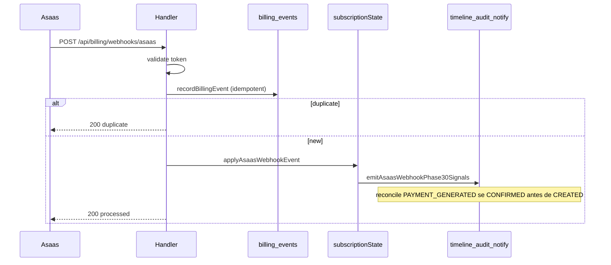

# S7 Billing — Phase 3.0 Architecture (Experience + Production Hardening)

## Princípios

- Backend = fonte de verdade (timeline, health, notifications, renewal).
- Frontend = apresentação + resiliência (sem regras financeiras).
- Timeline append-only com `idempotency_key` por `(user_id, key)`.
- Máximo 1 renewal cycle OPEN por subscription (Fase 2.1 + índice parcial).

## Webhook flow (Asaas)

Logs: `S7_BILLING_WEBHOOK_RECEIVED`, `S7_BILLING_WEBHOOK_PROCESSED`, `S7_BILLING_WEBHOOK_DUPLICATE`, `S7_BILLING_WEBHOOK_FAILED` (+ `duration_ms`, `provider_event_id`).

## Timeline

- Tabela: `billing_timeline_events`
- Serviço: `billingTimelineEventService.js`
- Webhook: `billingAsaasWebhookTimelineService.js`
- Chave idempotência webhook: `asaas:{providerEventId}:{eventType}:pay:{paymentId}`

## Audit

- Tabela: `billing_audit_logs`
- Sanitização: `billingAuditSanitize.js` (redact secrets)

## Notifications

- Templates: `billing_notification_templates`
- Dispatches: `billing_notification_dispatches`
- Serviço: `billingNotificationCenterService.js`

## Revenue health

- Cálculo: `billingRevenueHealthService.js`
- Snapshot opcional: `billing_revenue_health_snapshots`
- Exposto em `GET /api/billing/revenue-health` e `subscription/status`

## Idempotência

| Camada | Mecanismo |
|--------|-----------|
| Webhook ingress | `billing_events.provider_event_id` |
| Timeline | `billing_timeline_events (user_id, idempotency_key)` |
| Renewal OPEN | partial unique index + `billingRenewalCycleConsistencyService` |

## Consistency checks (Fase 3.0.4)

- Serviço: `billingConsistencyCheckService.js`
- Job: `POST /api/jobs/billing-consistency-check` (+ `X-Job-Secret`)
- Detecta: múltiplos OPEN cycles, pagamentos órfãos, timeline com subscription inválida, notifications sem user
- Opcional: `auto_reconcile_open_cycles: true` no body

## Frontend resilience (3.0.4)

- `billingDevGuard.js` — preview só em `import.meta.env.DEV`
- `billingResilienceUi.js` — mensagens + timeout 14s
- `useBillingFinancialExperience` — `Promise.allSettled` por bloco
- Revenue health fallback quando API indisponível

## Fallback strategy

- Falha de timeline → bloco erro + retry; página e tabela de pagamentos seguem.
- Falha de health → card fallback “indisponível”.
- Webhook phase30 falha → log `phase30_signals_failed`; estado de assinatura ainda aplicado no `applyAsaasWebhookEvent`.

## Scripts de validação (não runtime)

- `validateBillingPhase301DevVercel.mjs`
- `validateBillingPhase303FrontendDev.mjs`
- `validateBillingAsaasWebhookPhase301.mjs`

## Produção

Ver `BILLING_PRODUCTION_CHECKLIST.md`.
